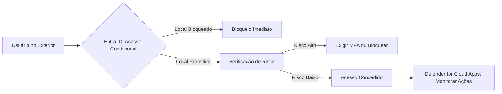

A guia **"Acesso Global Seguro"** não é uma opção nativa do **Microsoft Entra ID** (Microsoft 365). Esse termo refere-se a um **conceito arquitetural** ou a **soluções integradas** que combinam recursos do Entra ID com outros serviços da Microsoft (como **Microsoft Defender for Cloud Apps** ou **Azure AD Conditional Access**) para proteger o acesso a recursos globais.  

No entanto, se você está se referindo a funcionalidades relacionadas a **controle de acesso seguro em escala global**, os recursos mais relevantes estão distribuídos em diferentes seções do Entra ID. Abaixo, descrevo as opções exclusivas ou centrais para esse objetivo:

---

### **Recursos do Entra ID para "Acesso Global Seguro"**

#### **1. Acesso Condicional (Guia "Proteção")**  
   - **Políticas Baseadas em Localização**:  
     - Bloqueie ou restrinja logins de países/regiões não autorizadas.  
     - Exemplo: *"Bloquear acesso fora do Brasil"*.  
   - **Controles de Sessão**:  
     - Limite ações em aplicativos (ex.: download de dados) com base em condições de risco.  

#### **2. Microsoft Defender for Cloud Apps (Integrado ao Entra ID)**  
   - **Acesso Condicional de Aplicativos (CASB)**:  
     - Aplique políticas granulares a aplicativos SaaS (ex.: SharePoint Online, Salesforce):  
       - **Bloquear uploads de dados confidenciais** em regiões não permitidas.  
       - **Forçar uso de VPN** para acesso externo.  

#### **3. Identity Protection (Guia "Proteção")**  
   - **Políticas de Risco Global**:  
     - Exija MFA ou bloqueie logins com **risco agregado** (ex.: múltiplas tentativas de acesso de diferentes países em curto período).  

#### **4. Configurações de Segurança Global (Guia "Identidade")**  
   - **Padrões de Segurança**:  
     - Habilite políticas globais como:  
       - **Exigir MFA para todos os usuários**.  
       - **Bloquear autenticação legada** (ex.: POP3, IMAP).  
   - **Proteção por Senha**:  
     - Bloqueie senhas fracas em todo o locatário.  

#### **5. Governança de Acesso (Guia "Governança de Identidade")**  
   - **Pacotes de Acesso com Escopo Global**:  
     - Defina acesso a recursos críticos (ex.: "Todos os sites da empresa") para grupos internacionais.  
   - **Revisões de Acesso Multirregião**:  
     - Auditores em diferentes países podem revisar permissões simultaneamente.  

---

### **Recursos Exclusivos para Controle de Acesso Global**  
| Recurso | Onde Encontrar |  
|---------|----------------|  
| **Restrições Geográficas de Acesso Condicional** | Proteção > Acesso Condicional |  
| **Monitoramento de Atividade Global via Defender for Cloud Apps** | Integração externa (portal do Defender) |  
| **Padrões de Segurança Habilitados para Todo o Locatário** | Identidade > Segurança > Padrões de Segurança |  
| **Políticas de Risco Aplicadas Globalmente** | Proteção > Identity Protection |  

---

### **Soluções Complementares para "Acesso Global Seguro"**  
1. **Microsoft Entra Internet Access**:  
   - Filtra tráfego de internet **antes de chegar aos aplicativos**, bloqueando ameaças e acessos não autorizados por região.  
2. **Microsoft Entra Private Access**:  
   - Garante acesso **zero-trust** a recursos locais/privados sem exposição à internet.  
3. **Azure Firewall**:  
   - Define políticas de rede globais (ex.: bloquear tráfego de IPs suspeitos).  

---

### **Como Implementar "Acesso Global Seguro" no Entra ID**  
1. **Defina Políticas de Localização**:  
   - *Acesso Condicional > Nova política*:  
     - Condição: `Locais` → Selecione "Qualquer local" e exclua países permitidos.  
     - Controle: `Bloquear acesso`.  
2. **Proteja Aplicativos com Defender for Cloud Apps**:  
   - Conecte aplicativos SaaS ao Defender.  
   - Crie políticas de **restrição geográfica** ou **criptografia de dados**.  
3. **Habilite Padrões de Segurança Globais**:  
   - *Identidade > Segurança > Padrões de Segurança*:  
     - Ative **"Exigir MFA para administradores"** e **"Bloquear autenticação básica"**.  

---

### **Importante!**  
- **"Secure Global Access" não é uma guia específica**, mas um **conjunto de práticas** usando múltiplos recursos.  
- A Microsoft usa esse termo em contextos de **arquitetura de segurança** ou em soluções como **Microsoft Entra Internet/Private Access**.  
- Recursos avançados exigem licenças **Microsoft 365 E5** ou **Entra ID Premium P2**.  

---

### **Exemplo de Fluxo de Acesso Global Seguro**  
